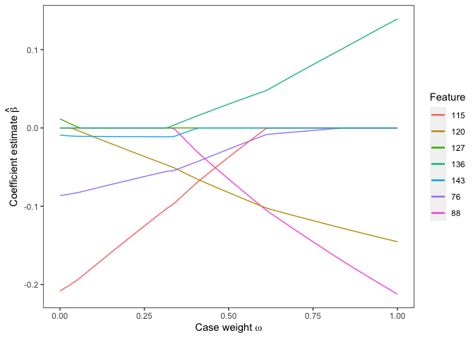
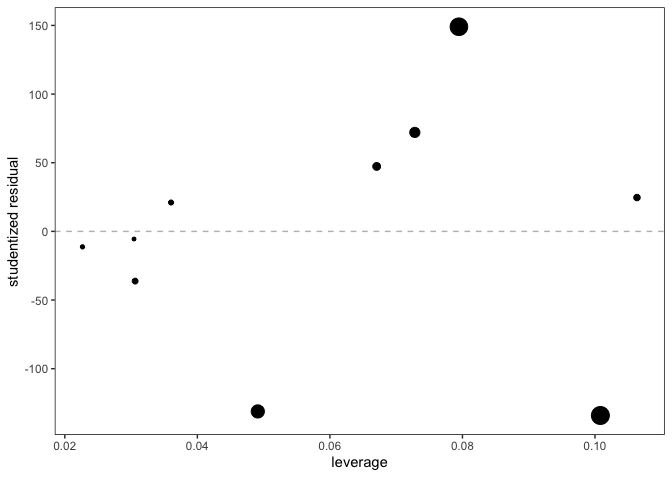
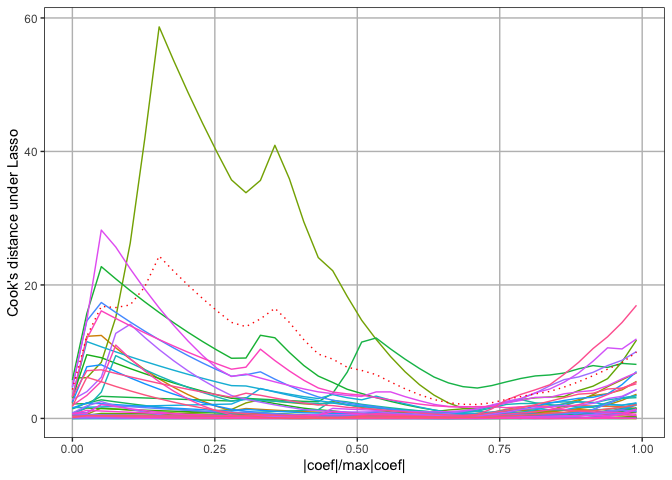

# CaseWeightLasso

## Overview

CaseWeightLasso focuses on the Case-weight Adjusted Lasso Model: $$
\min_{\beta_0,\mathbf{\beta}}\quad \frac{1}{2}\sum_{i\neq k} (y_i - \beta_0 - \mathbf{x}_i^\top\mathbf{\beta})^2 + \frac{1}{2}\omega(y_k - \beta_0 - \mathbf{x}_k^\top\mathbf{\beta})^2 +\lambda \sum_{j=1}^p |\beta_j|
$$

The main utility of this package is the solution path algorithm and
calculating the exact Cook’s distance for the Lasso for observations of
interest. The details can be found in \[\]. This package is built based
on [lars](https://cran.r-project.org/web/packages/lars/index.html)
package by Hastie et al and require
[tidyverse](https://www.tidyverse.org/) and
[latex2exp](https://cran.r-project.org/web/packages/latex2exp/index.html)
as prerequisites.

## Installation

You can install from CRAN with:

``` r
install.packages("CaseWeightLasso")
```

You can also install the development version from GitHub using
[devtools](http://cran.r-project.org/web/packages/devtools/index.html):

``` r
devtools::install_github('zbjiao/CaseWeightLasso')
```

## Usage

``` r
library(CaseWeightLasso, quietly = T)
```

    ## Loaded lars 1.3

    ## ── Attaching core tidyverse packages ──────────────────────── tidyverse 2.0.0 ──
    ## ✔ dplyr     1.1.3     ✔ readr     2.1.4
    ## ✔ forcats   1.0.0     ✔ stringr   1.5.0
    ## ✔ ggplot2   3.4.3     ✔ tibble    3.2.1
    ## ✔ lubridate 1.9.2     ✔ tidyr     1.3.0
    ## ✔ purrr     1.0.2     
    ## ── Conflicts ────────────────────────────────────────── tidyverse_conflicts() ──
    ## ✖ dplyr::filter() masks stats::filter()
    ## ✖ dplyr::lag()    masks stats::lag()
    ## ℹ Use the conflicted package (<http://conflicted.r-lib.org/>) to force all conflicts to become errors

We use synthetic data to demonstrate the usage of this package. Consider
X has $n=50$, $p=200$. Only the first 5 predictors are informative.

$$
y = 5x_1+4x_2+3x_3+2x_4+x_5 + e,\ e\sim N(0,1).
$$

``` r
set.seed(100)
x = matrix(rnorm(50*200),nrow=50)
y = x[,1:5]%*%c(5,4,3,2,1) + rnorm(50)
```

### Leave-one-out Solution Path

Suppose we are interested in observation 1’s influence on the model at
fraction = 0.7:

``` r
obj = SolPathLooLasso(x,y,k = 1, s = 0.7, mode = "fraction")
```

\`obj’ is a SolPathLooLasso object that records the path of different
statistics as $\omega$ decreases from 1 to 0. We can plot solution path
(only coefficients that have sign change are included in the figure),

``` r
plot(obj)
```

<!-- -->

output the leave-one-out estimate of $y$ given a new set of $x$,

``` r
predict(obj,t(rnorm(200)),'fit')
```

    ## $obs_of_interest
    ## [1] 1
    ## 
    ## $fit
    ## [1] 2.236312

or simply output the leave-one-out estimate of coefficients.

``` r
coef(obj)[2:12,]
```

    ##  [1] 26.936606 31.062845 14.952128  8.337806  5.650303  0.000000  0.000000
    ##  [8]  0.000000  0.000000  0.000000  0.000000

### Cook’s distance for the Lasso

Another part of this package is calculating and visualizing Cook’s
distance for the Lasso.

The option ‘resid’ gives you the residual-leverage plot.

``` r
obj1 = CookDisLasso(x,y, k=1:10, s=c(0.1,0.2), mode = "fraction", threshold = FALSE)
plot(obj1, 'resid', 1)
```

<!-- -->

The option ‘case-influence-graph’ gives you the case influence graph
where you can see how case influence for the Lasso of each samples
change as penalty level increases.

``` r
obj2 = CookDisLasso(x,y, fineness=40, threshold = TRUE)
plot(obj2, 'case-influence-graph')
```

<!-- -->
